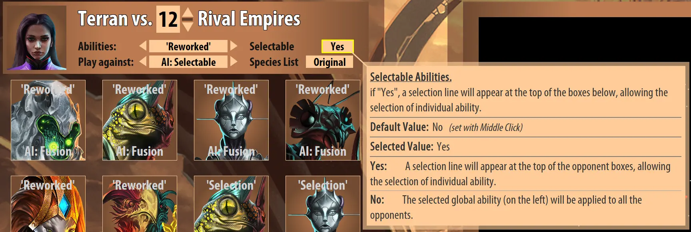
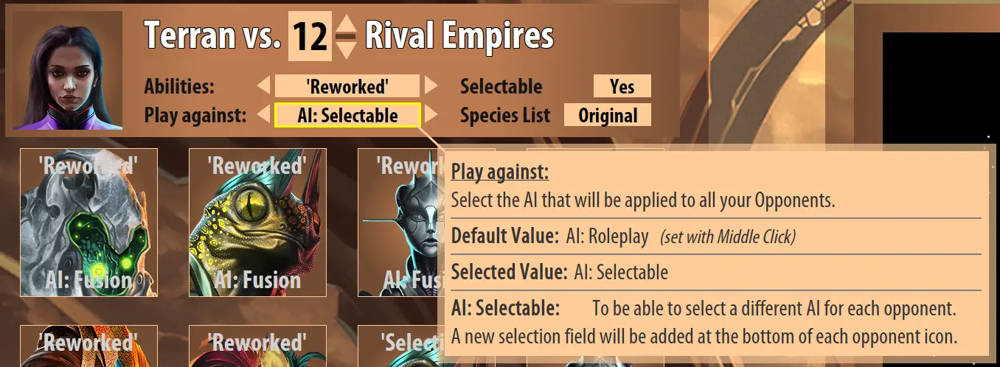
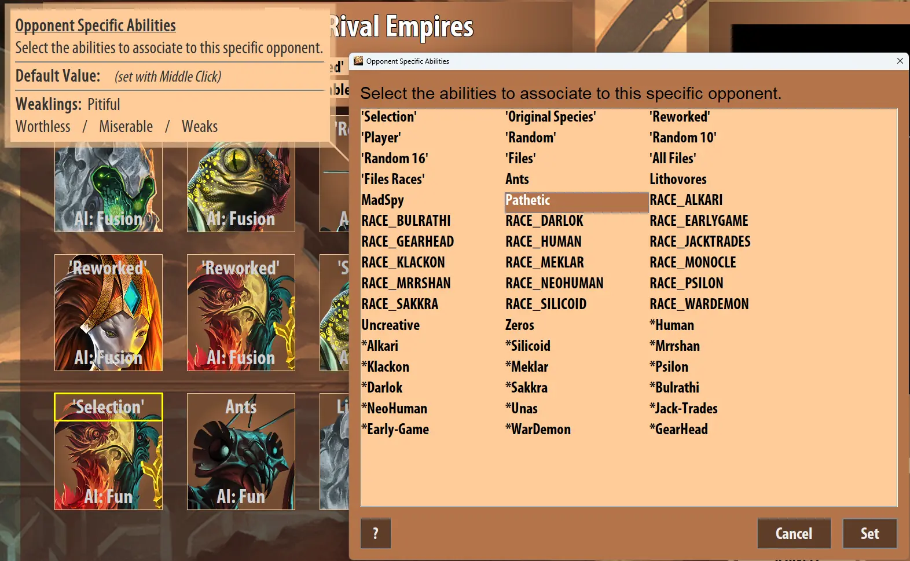

#### How to fully customize your opponents:

First enable the selectable abilities to display a selection box on the top of opponents icons.

You can also activate individual AI selection box on the bottom of opponents icons.

Then Ctrl-click on the selection box to open the selection list that will include all your saved species.

